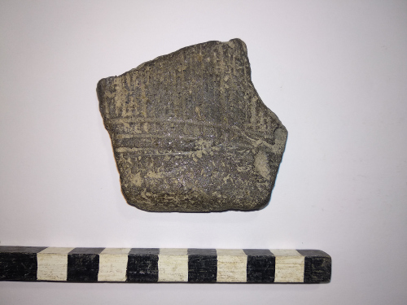
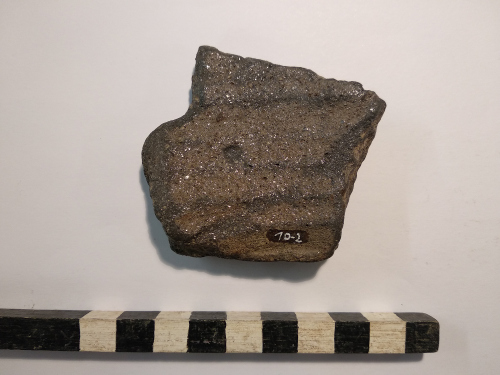
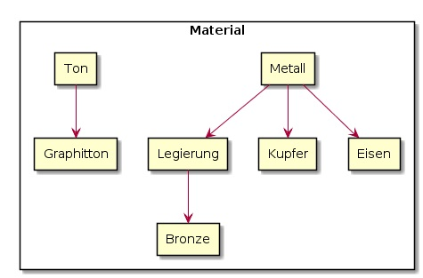
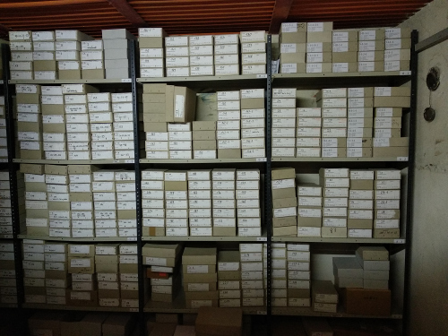
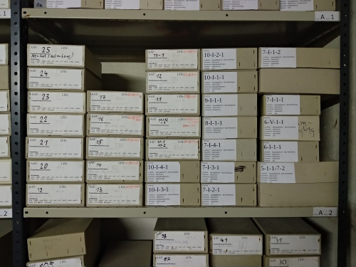
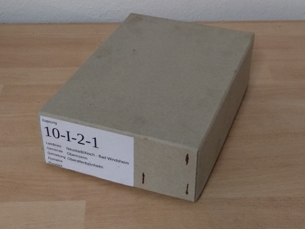

# Benutzerhandbuch der Anwendung "Munins Archiv"

## Inhaltsverzeichnis

1. [Betriebsumgebung](#1-betriebsumgebung)
    1. [Bestandteile](#11-bestandteile)
    1. [Einrichtung](#12-einrichtung)
1. [Programmelemente](#2-programmelemente)
    1. [Fund](#21-fund)
    1. [Fundattribut](#22-fundattribut)
    1. [Kontext](#23-kontext)
    1. [Ablage](#24-ablage)
    1. [Ort](#25-ort)
1. [Glossar](#3-glossar)
1. [Quellenverzeichnis](#4-quellenverzeichnis)

## 1. Betriebsumgebung

### 1.1. Bestandteile

1. Webserver: z. B. Apache Http Server
1. Datenbankserver: MySQL5 Server

### 1.2. Einrichtung

Abhängig vom Betriebssystem Ihres Servers gibt es unterschiedliche Möglichkeiten, den Datenbankserver und den Webserver einzeln zu installieren. Sie können aber auch alle benötigten Dienste mit dem Paket [XAMPP](https://www.apachefriends.org/de/index.html) installieren.

#### 1.2.1. Datenbank

1. Datenbankserver einrichten (MySQL-Server oder MariaDB-Server)
1. Datenbank „Munins_Archiv“ anlegen
1. Benutzer anlegen
    1. Name: Munin
    1. Passwort: Erinnerung
    1. Lese- und Schreibrechte für die Datenbank vergeben
    1. SQL-Skripte ausführen
1. create.sql
1. insert data into AblageTyp.sql
1. insert data into FundAttributTyp.sql
1. insert data into KontextTyp.sql
1. insert data into OrtTyp.sql

#### 1.2.2. Website

1. Beliebigen Webserver für PHP einrichten (z. B. Apache Http Server oder Microsoft Internet Information Services)
2. Inhalt des Ordners „src“ aus dem git-Repository als Wurzel der Website einrichten

## 2. Programmelemente

Anwender treten mit unterschiedlichen Fragen und Verwaltungsaufgaben an die Daten in Munins Archiv heran. Um Übersichtlichkeit zu erlangen, sind die Daten der Anwendung zu Themen zusammengefasst. Funde, Kontexte und Ablagen bilden jeweils einen eigenen Schwerpunkt und sind trotzdem miteinander verknüpft.

### 2.1. Fund

Die Kernkompetenz von Munins Archiv ist das Verwalten archäologischer Archive. Daraus resultiert, dass das zentrale Element der Anwendung der Fund ist.

Eine Annahme ist, dass in klassischen Programmen die Daten von Funden aus einem Fundtyp und einem Beschreibungstext bestehen. Hinzu kommen können Fotos und Schlagworte. Bei einem solchen Datenmodell stellt sich die Frage, wo die Spezialisierung des Fundtyps endet und wo die reine Beschreibung im Fließtext beginnt. Beispiel: Ist die Spezifizierung „Kammstrichrandscherbe“ (siehe Abbildung 1) noch der Fundtyp oder bereits Beschreibung? Wenn „Kammstrichkeramik“ als Teil der Beschreibung zählt, was ist dann der Fundtyp? Ist es „Randscherbe“, „Scherbe“ oder etwas anderes? Aus diesem Grund gibt es in Munins Archiv für Funde keinen Typ. Eine Beschreibung des Fundes als Fließtext ist ebenso nicht vorgesehen. Hier liegt der Grund im erwarteten Aufwand, eine Textsuche zu implementieren, die mit Synonymen und Wortbeugungen in den Textbeschreibungen umgehen kann.

  
*Abbildung 1 - Graphittonwandscherbe mit Kammstrichverzierung*

Der Fund besteht in Munins Archiv aus einer Kombination von Merkmalsausprägungen, den sogenannten **Fundattributen**. Für weitere Details und Beispiele siehe [Kapitel 2.2.](#22-fundattribut).

Um einen Fund zu identifizieren, wird er beschriftet, siehe Abbildung 2. Für die **Beschriftung** ist in Munins Archiv ein Feld vorgesehen, in das ein beliebiger Text eingegeben werden kann. Damit ist die Anwendung sehr kompatibel mit unterschiedlichen Identifikationssystemen.

  
*Abbildung 2 - Graphittonwandscherbe mit Kammstrichverzierung mit Beschriftung "10-2"*

In der Praxis sind nicht nur besondere Einzelfunde zu erfassen, sondern auch Massenfunde, die zu Dutzenden oder Tausenden auftreten. Um den Aufwand bei der Verwaltung und der technischen Datenhaltung gering zu halten, gibt es für jeden Funddatensatz das Merkmal **Anzahl** mit dem Standardwert „1“. Ist das Ermitteln der exakten Anzahl zu aufwändig, kann eine Mindestangabe erfolgen, z. B. „>50“ (mindestens 50 Exemplare). Wichtig ist hierbei, dass tatsächlich bis zu der angegebenen Anzahl gezählt wird. Schließlich kann es im Fall einer exakten Zählung, bspw. bei einer Inventur, zur irrtümlichen Annahme kommen, dass Funde aphandengekommen sind.

Jeder Fund hat eine Herkunft, sei es durch eine Feldbegehung oder eine Grabung. Die Zuordnung der Funde zu ihrem Herkunftskontext ist von großer Bedeutung für eine wissenschaftliche Auswertung. Eine detaillierte Auseinandersetzung mit dem **Kontext** findet in [Kapitel 2.3.](#23-kontext) statt.

Neben der Herkunft verwaltet Munins Archiv auch den Verbleib des Fundes mittels sogenannter **Ablagen**, siehe [Kapitel 2.4.](#24-ablage).

### 2.2. Fundattribut

Fundattribute gehören zu einem bestimmten **Typ**, z. B. „Material“, und haben einen spezifischen Wert, bspw. „Ton“. Sowohl die Typen als auch die Werte kann der Anwender beliebig festlegen. Je mehr Attribute der Anwender mit einem Fund verknüpft, desto ausführlicher ist dieser beschrieben.

Die Idee hinter dieser Technik entspricht dem folgenden Vorgang. Jemand notiert stichwortartig Begriffspaare aus einem Merkmal und einer Ausprägung auf Karteikarten. Die Person versucht dabei alle ihr bestimmbaren Eigenschaften des Fundes festzuhalten. Dabei kann es mehrere Karteikarten mit einem Merkmal, aber mit unterschiedlicher Ausprägung geben.

Die folgenden Merkmale und Ausprägungen in Abbildung 3 orientieren sich am Beispiel der Graphitton aus Abbildung 1:

  
*Abbildung 1 - Graphittonwandscherbe mit Kammstrichverzierung*

@startuml
rectangle {
rectangle "**Material:** Graphitton"
rectangle "**Gegenstand:** Gefäß"
rectangle "**Erhaltung:** Wandfragment"
rectangle "**Verzierung:** Kammstrich"
}
@enduml
*Abbildung 3 - Fundbeschreibung mittels Fundattributen als Karteikarten*

Aufgrund der Fülle von Ausprägungen sowie Synonymen sind die Fundattribute **hierarchisch** strukturiert. Das heißt, dass der Anwender in der obersten Ebene allgemeine Ausprägungen vorfindet und darunter Spezifizierungen. Beispiel: Im Typ „Material“ befinden sich u.a. die Ausprägungen „Metall“, „Gestein“ und „Knochen“. Unter „Metall“ könnten Untergruppen, wie bspw. „Legierung“, „Edelmetall“ oder „Nichtedelmetall“ aufgeführt sein, bevor „Eisen“, „Kupfer“, „Bronze“ etc. zu finden sind.

Beim Beispiel der Graphittonscherbe ist „Graphitton“ eine Spezialisierung von „Ton“ vgl. Abbildung 4.

  
*Abbildung 4 - Hierarchische Struktur von Fundattributen*

Für die Erfassung von Funden ergibt sich mit der hierarchischen Schlagworttechnik der Fundattribute der Vorteil, dass flexibel auf den Grad der Spezifizierung eingegangen werden kann. Wenn zum Beispiel der Erfasser das Material des Fundes als Metall bestimmen kann, aber nicht mehr, um welches Metall bzw. um welche Legierung es sich handelt, dann verknüpft er nur das Attribut „Metall“. Falls bei der Restaurierung des Fundes festgestellt wird, dass es sich um eine Bronzelegierung handelt, dann kann der Restaurator die Merkmalsbestimmung entsprechend der Hierarchie verfeinern.

### 2.3. Kontext

Wie, wo und wann Funde geborgen bzw. aufgelesen wurden, beschreibt der Kontext. Die Kontexttypen sind im Programm fest hinterlegt und können in ihrer Struktur nicht vom Anwender beeinflusst werden.

Aufgrund der unterschiedlichen Dokumentationsarten und -traditionen bei Grabungen, stellt Munins Archiv aktuell keine Möglichkeit bereit, Grabungen zu erfassen und zu verwalten. Diese Funktionen sind jedoch für zukünftige Programmversionen vorgesehen.

#### 2.3.1. Fundstelle

Der Kontexttyp Fundstelle dient der Registrierung von Grabungen und Begehungen. Die Zuordnung der Grabungen und Begehungen zu einer Fundstelle ist von der räumlichen Nähe und der individuellen Beurteilung abhängig. Von herausragender Tragweite ist das System, mit dem Fundstellen benannt bzw. identifiziert werden. Dieses Identifikationssystem sollte einheitlich und konsequent angewendet werden, zum Beispiel in Form einer lückenlosen Nummerierung beginnend mit „1“. In der Praxis finden jedoch Umstellungen von Identifikationssystem statt. Munins Archiv versucht, Systembrüche und -änderungen zu unterstützen, indem es keine Vorgaben bei der Benennung macht.

#### 2.3.2. Begehungsfläche

Eine Begehungsfläche ist eine definierte, geografische, abgegrenzte Fläche, zum Beispiel der Teil eines Ackers. Diese Fläche kann mit **Ortsangaben** (siehe [Kapitel 2.5.](#25-ort)) verknüpft werden, die der Anwender im System hinterlegt hat.

Wenn Begehungsflächen sehr nahe beieinander liegen, dann werden sie einer Fundstelle zugeordnet. Die Entscheidung über die Fundstellenzuordnung liegt jedoch im Ermessen des Anwenders. Begehungsflächen können nicht nur aneinander grenzen, sondern sie können einander schneiden oder einanderen umschließen. Für diese hohe Flexibilität gibt es mehrere Gründe. Zum einen kann somit eine Fundkonzentration hervorgehoben werden, zum anderen können auf diese Weise Zusatzbemerkungen in Protokollen abgebildet werden.

#### 2.3.3. Begehung

Die Begehung ist der zeitlich bestimmbare Vorgang, Funde auf einer Begehungsfläche aufzulesen. Infolge dessen hat dieser Kontexttyp ein **Datum** und ist mit den **Funden** verknüpft.

Natürliche und agrawirtschaftliche Bodenbewegungen erfordern, dass das Fundaufkommen der Begehungsflächen mehrmals pro Jahr und über viele Jahre hinweg beobachtet werden müssen. Entsprechend können einer Begehungsfläche beliebig viele Begehungsaktivitäten zugeordnet werden.
Jede gemeldete Begehung erhält vom zuständigen Landesamt für Denkmalpflege (LfD) eine Registrierungsnummer, die in Munins Archiv als **LfD-Nr.** hinterlegt werden kann. Das Schema dieser Nummer ist abhängig vom Bundesland und dem aktuell eingesetzten System. Beispiele für LfD-Nummern: „2017-25“, „6538\0015“ und „E-2008-343-10_0-1“.

Zu den Begehungen werden Protokolle angefertigt, in denen Auffälligkeiten der Umgebung und die Funde festgehalten sind. Um diese Daten nicht zu verlieren, kann der Anwender jeder Begehung einen **Kommentar** hinzufügen.

### 2.4. Ablage

Funde werden in Ablagen organisiert, damit sie im tatsächlichen Archiv leicht gefunden werden können. Eine Ablage besitzt einen **Typ** und einen **Namen**, zum Beispiel: Typ = „Regal“, Name = „A“. Die Typen und Namen sollten so festgelegt werden, dass sie den Ablageorten im Archiv entsprechen.

Ablagen können hierarchisch angelegt werden. So kann beispielsweise die Ablage „Regal A“ der Ablage „Raum Archiv“ untergeordnet sein. In „Regal A“ (Abbildung 5) selbst kann das „Regalbrett 2“ (Abbildung 6) vorhanden sein, welches einen „Karton 10-I-2-1“ (Abbildung 7) enthält, siehe Abbildung 8.

  
*Abbildung 5 - Regal A bis C (rechts nach links)*

  
*Abbildung 6 - Regalbrett 2*

  
*Abbildung 7 - Karton 10-I-2-1*

Sinnvollerweise werden die Ablagen so angelegt, dass sie sich auch tatsächlich in der angegebenen Ablage befinden. So sollte das „Regal A“ auch wirklich im „Raum Archiv“ stehen und ein „Regalbrett 2“ mit dem „Karton 10-I-2-1“ und all seinen Funden enthalten.

@startuml
rectangle "**Raum:** Archiv" as raumArchiv
rectangle "**Regal:** A" as regalA
rectangle "**Regalbrett:** 2" as regalbrett2
rectangle "**Karton:** 10-I-2-1" as karton10I21
rectangle "**Regal:** B" as regal1B
rectangle "**Regal:** C" as regalC
raumArchiv --> regalA
regalA --> regalbrett2
regalbrett2 --> karton10I21
raumArchiv --> regal1B
raumArchiv --> regalC
@enduml
*Abbildung 8 - Beispiel für hierarchische Ablagestruktur*

### 2.5. Ort

Der Kontext „Begehungsfläche“ bei Begehung ist ein Ortskontext. Er gibt Antwort auf die Frage, wo Funde geborgen wurden. Dazu werden sie mit Ortselementen verknüpft, die politische oder topografische Gebiete bzw. Objekte repräsentieren.

In Munins Archiv bildet der Anwender die realen Gegebenheiten selbst ab. Der Anwender hat bei der Benennung, Verknüpfung und Klassifizierung der Ortsdaten volle Gestaltungsfreiheit. Beispielsweise kann der Anwender auf der Ebene der Bundesländer beginnen und über Landkreise, kreisfreie Städte bis zur Hausnummer eine Datenstruktur mit politischen Grenzen erstellen. Ein anderes Beispiel ist, dass der Anwender von topografischen Gesichtspunkten ausgeht und Flurnamen verwendet: Stadtwald, Schlossberg, Karpfenteich etc. Ideal ist eine Mischung aus politischen und topografischen Merkmalen, sodass eine schnelle Orientierung möglich ist.

Eine Vorgabe von Ortsdaten oder Ortsstrukturen kann Munins Archiv nicht anbieten, weil die Zugehörigkeit von Gebieten infolge der historischen Entwicklung zu komplex ist.

## 3. Glossar

### Ablage

Bei einer Ablage handelt es sich um eine archivarische Organisationseinheit zur Aufbewahrung von Funden, z. B. Karton, oder zur Strukturierung anderer archivarischer Organisationseinheiten, bspw. Archivraum.

### Begehung

Konkrete Beobachtung einer Untersuchungsfläche auf Fundaufkommen zu einem bestimmten Zeitpunkt, siehe auch Kontext.

### Begehungsfläche

Abgegrenzte Fläche, auf der oberirdische Fundaufkommen beobachtet werden, ohne einen Bodeneingriff vorzunehmen, siehe auch Kontext.

### Fund

Ein Fund ist eine materielle Hinterlassenschaft, die ihrem Auffindungskontext entnommen und archiviert werden kann. In der Mehrheit handelt es sich um Artefakte und Artefaktreste, z. B. Werkzeuge und Scherben. Hinzu kommen biologische Hinterlassenschaften, wie bspw. Knochen.

### Fundstelle

Oberste organisatorische Einheit, die durch ihre Unterelemente zeitlich und räumlich konkretisiert wird, siehe auch Kontext.

### Grabung

Invasive, strukturierte und wissenschaftliche Bodenuntersuchung zu einem bestimmten Zeitpunkt, siehe auch Kontext.

### Kontext

Mit Kontext ist der organisatorische, räumliche und zeitliche Zusammenhang gemeint, in dem ein Fund geborgen wurde. Die Einteilung eines Kontextes ist fest vorgegeben. Es wird zwischen zwei Varianten unterschieden: Grabungen und Begehungen.

### Ort

Ortsdaten sind Teil der räumlichen Kontexte, z. B. Begehungsfläche (Begehung) und Fläche (Grabung). Es handelt sich nicht um Koordinaten, sondern um eine strukturierte räumliche Einheit, die eine politische oder topografische Grundlage aufweist.

## 4. Quellenverzeichnis

### [Eggert, 2012]

Prähistorische Archäologie; Konzepte und Methoden; Manfred K. H. Eggert; Narr Francke Attempo Verlag GmbH & Co. KG; 4. Auflage; 2012; ISBN 978-3-8252-3696-0
