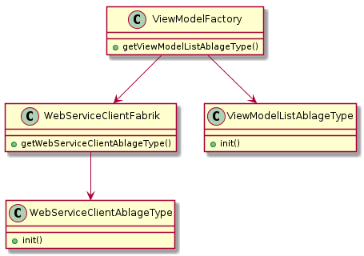
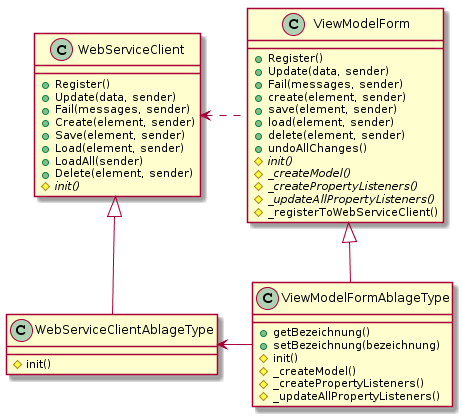

# Entwicklerhandbuch der Anwendung "Munins Archiv"

## Inhaltsverzeichnis

1. [Entwicklungsumgebung](#1-entwicklungsumgebung)
    1. [Bestandteile](#11-bestandteile)
    1. [Einrichtung](#12-einrichtung)
1. [Verzeichnisstruktur](#2-verzeichnisstruktur)
1. [Verwendete Pakete](#3-verwendete-pakete)
1. [Architektur](#4-architektur)
    1. [Client-Server-Architektur](#41-client-server-architektur)
    1. [Mehrschichtenarchitektur](#42-mehrschichtenarchitektur)
    1. [Web-Service-Architektur](#43-web-service-architektur)
    1. [Entwurfsmuster](#44-entwurfsmuster)
1. [Benutzerführung](#5-benutzerfhrung)
1. [Logfunktion](#6-logfunktion)
1. [Releasemanagement](#7-releasemanagement)

## 1. Entwicklungsumgebung

### 1.1. Bestandteile

1. Webserver: z. B. Apache Http Server
1. Datenbankserver: MySQL5 Server
1. Versionsverwaltungssystem: git

### 1.2. Einrichtung

#### 1.2.1. Datenbank

1. Datenbankserver einrichten (MySQL5-Server)
1. Datenbank „Munins_Archiv“ anlegen
1. Benutzer anlegen
    1. Name: Munin
    1. Passwort: Erinnerung
1. Lese- und Schreibrechte für die Datenbank vergeben
1. SQL-Skripte ausführen
    1. create.sql
    1. insert data into AblageTyp.sql
    1. insert data into FundAttributTyp.sql
    1. insert data into KontextTyp.sql
    1. insert data into OrtTyp.sql

#### 1.2.2. Website

1. Beliebigen Webserver einrichten (z. B. Apache Http Server)
1. git-Repository als Wurzel der Website einrichten ([http://localhost:80/Munins Archiv/src](http://localhost:80/Munins%20Archiv/src))

## 2. Verzeichnisstruktur
  
* **/db** - Die Skripte zum Erstellen und Befüllen der Datenbank befinden sich im Verzeichnis "db" (database -> Datenbank).  
* **/doc** - Die Dokumentation zum Projekt, inklusive der Handbücher, befindet sich im Verzeichnis "doc" (documents -> Dokumente).
* **/pkg** - Programmbibliotheken und -erweiterungen von Drittanbietern sind in "pkg" (packages -> Pakete) gespeichert.
* **/prototypes** - Prozess-, Architektur- und Designstudien befinden sich in "prototypes" (prototypes -> Prototypen).
* **/src** - Der Quellcode befindet sich unter "src" (sources -> Quellcode). Als Sprachen kommen hier HTML, JavaScript und PHP zum Einsatz.
* **/tst** - Die automatisierten Tests für die Schichten der Serverseite befinden sich im Verzeichnis "tst" (test -> Test).
* **/upgr** - Die Skripte zum Aktualisieren der Anwendung auf die neueste Version befinden sich unter "upgr" (upgrade -> Auktualisierung).

## 3. Verwendete Pakete

* [Apache log4php](https://logging.apache.org/log4php/download.html) v2.3.0 von der **Apache Software Foundation** unter der *Apache-Lizenz 2.0*
* [Font Awesome Icons](https://fontawesome.com/) v5.3.1 von **Fonticons, Inc.** unter der *CC BY 4.0 Lizenz*
* [jQuery min](https://jquery.com/) v3.3.1 von der **jQuery Foundation** unter der *MIT-Lizenz*
* [jQuery UI](https://jquery.com/) v1.12.1 von der **jQuery Foundation** unter der *MIT-Lizenz*
* [jQuery Toast Plugin](https://github.com/kamranahmedse/jquery-toast-plugin) v1.3.2 von **Kamran Ahmed** unter der *MIT-Lizenz*
* [jsGrid](http://js-grid.com/) v1.5.3 von **Artem Tabalin** unter der *MIT-Lizenz*
* [jsTree](https://www.jstree.com/) v3.3.5 unter der *MIT-Lizenz*

## 4. Architektur

### 4.1. Client-Server-Architektur  

_Munins Archiv_ ist eine Web-Anwendung und damit eine Client-Server-Anwendung. Der Client ist der Browser, z. B. Firefox. Ein wesentlicher Vorteil dieser Architektur besteht darin, dass der Client-Computer nur einen Broswer benötigt. Neue Versionen müssen nur auf dem Server installiert werden. Alle Clients verwenden umgehend die aktuelle auf dem Server installierte Version.  
  
Darüber hinaus können etablierte Web-Mechanismen übernommen werden, z. B. Caching.

### 4.2. Mehrschichtenarchitektur  

_Munins Archiv_ besteht aus mehreren Schicht, die sich auf verschiedenen Rechnern verteilen lassen.
  
Die **Datenschicht** befindet sich auf dem Datenbankserver und ist mit dem DBMS MySQL umgesetzt. Für _Munins Archiv_ ist eine Datenbank erforderlich.  
  
Die **serverseitige Anwendungsschicht** befindet sich auf dem Applikationsserver, der mit dem Datenbankserver identisch sein kann. Aufgrund der verwendeten Sprache, PHP, ist der eingesetzte Web-Dienste Apache2. Die PHP-Skripte lesen, verarbeiten und speichern die Daten aus der Datenbank und bilden somit eine Brücke zwischen der Clientseite und der Datenbank. Dabei untergliedert sich diese Schicht in weitere Unterschichten: Models, Factories, User Stories und Web Services.  
  
Das **Model** beschreibt lediglich die Datenstruktur, z. B. eine Ablage.  
  
Die **Factory** kümmert sich um das Laden, Ändern, Löschen und Speichern des Models.  
  
Die **User Story** deckt einen konkreten Anwendungsfall ab, z. B. ein Benutzer legt eine neue Ablage an.  
  
Der **Web Service** ist die Schnittstelle zwischen dem Client und den User Stories. Er bereitet Voraussetzungen für die User Story vor, führt die User Story aus und gibt das Ergebnis an den Client weiter.  
  
Die clientseitige Anwendungsschicht besteht aus dem HTML, CSS und JavaScript (jQuery). Die **View** besteht aus dem HTML, CSS und dem JavaScript, welches die GUI manipuliert. Daten und Zustandsinformationen erhält die View vom **ViewModel**, welches Methoden zur Änderung von Werten der Datenobjekte sowie Aktionen, wie bspw. Laden, Löschen oder Speichern, zur Verfügung stellt. Die Aktionen des ViewModels rufen ihr jeweiliges Gegenstück im Webservice auf. Änderungen des ViewModels erfährt die View durch Registrierung für gewisse Änderungsereignisse, siehe [Observer-Patterns](https://de.wikipedia.org/wiki/Beobachter_(Entwurfsmuster)).
  
### 4.3. Web-Service-Architektur  
  
PHP bietet die Möglichkeit, HTML-Code zu generieren, zu manipulieren und an den Browser zu schicken. In der Architektur von _Munins Archiv_ ist dies nicht vorgesehen. Die serverseitige Anwendungsschicht ist ein Web-Service, um Daten zu erzeugen, zu suchen, zu bearbeiten, zu löschen und zu speichern. Die Ausgabe der Daten erfolgt im JSON-Format. Um den Aufruf des Webservices unabhängig von der eingesetzten Serversprache zu machen, findet der Einsatz von URL-Rewriting statt.

Ziel der sprachneutralen Web-Service-Architektur ist es, einen Austausch der serverseitigen Applikationssprache zu vereinfachen. So kann PHP bspw. gegen Java oder ASP.NET ausgewechselt werden, ohne dass der Clientcode geändert werden muss.

### 4.4. Entwurfsmuster

#### 4.4.1. Schablonenmethode

Auf der Serverseite wird das [Schablonenmethodenmuster](https://de.wikipedia.org/wiki/Schablonenmethode) (Template Method Pattern) bei den User Stories (Anwendererzählungen) angewandt. Sie bilden die Geschäftslogik des Webservices ab. Alle User Stories laufen gleich ab. Wenn sie über `run()` gestartet wird, werden in `areParametersValid()` die Parameter individuell geprüft. Diese Methode ist in der abstrakten Klasse UserStory abstrakt und muss von den abgeleiteten Klassen implementiert werden. Falls es bei der Überprüfung keinen Fehler gab, führt die User Story mit `execute()` den eigentlichen Vorgang aus. Auch diese abstrakte Methode muss von den abgeleiteten Klassen implementiert werden. Im Fehlerfall kann in den konkreten User Story-Klassen mit `addMessage()` zu jedem Verstoß der Akzeptanzbedingungen eine Meldung geschrieben werden. Der Verwender einer User Story kann über `getMessages()` die Fehlermeldungen auslesen, um sie zu loggen oder dem Benutzer anzuzeigen.

Die konkreten User Stories unterscheiden sich anhand ihrer Ein- und Ausgabeparameter, der Akzeptanzbedingungen in der Prüfungsmethode und dem auszuführenden Geschäftsvorfall.

  
*Abbildung 1 - Schablonenmethodenmuster am Beispiel der Ablage-User Stories*

#### 4.4.2. Fabrikmethode

Auf der Clientseite wird das [Fabrikmethodenmuster](https://de.wikipedia.org/wiki/Fabrikmethode) (Factory Method Pattern) bei den WebServiceClients und ViewModels angewandt. Die WebServiceClient-Fabrikmethoden instanziieren eine WebServiceClient-Instanz und führen dessen `init()`-Methode aus. Im Fall der ViewModel-Fabrikmethoden wird zuerst mit Hilfe der WebServiceClient-Fabrik der passende WebServiceClient instanziiert und dem ViewModel-Konstruktor als Parameter übergeben. Abschließend ruft die Fabrikmethode die `init()`-Methode des ViewModel-Objekts auf.

  
*Abbildung 2 - Fabrikmethodenmuster am Beispiel der WebServiceClients und ViewModels des AblageTypes*

#### 4.4.3. Beobachter

Auf der Clientseite wird das [Beobachtermuster](https://de.wikipedia.org/wiki/Beobachter_(Entwurfsmuster)) (Observer Pattern) bei den WebServiceClients und ViewModels angewandt. Die WebServiceClients (Subjekt) kommunizieren mit dem WebService und sind von daher für den Client - speziell für die ViewModels (Beobachter) - eine Datenquelle. Die ViewModels (Subjekt) stellen der View (Beobachter) einen Zustandsautomaten zur Verfügung.

Ein oder mehrere *Beobachter* können sich bei einem *Subjekt* für ein oder mehrere Eregnisse registrieren. Der Vorteil des Beobachtermusters ist, dass es keines Beobachters bedarf, damit das Subjekt funktioniert. Die Konsequens ist, dass ein ViewModel ohne Oberfläche und ohne WebService automatisiert getestet werden kann. Des Weiteren kann ein View-Control ein ViewModel verwenden, auch wenn es nur einen Teil der Funktionalität benötigt. Das ViewModel arbeit dabei innerhalb seiner Zustände, um gültige Operationen zu ermöglichen.

  
*Abbildung 3 - Beobachtermuster am Beispiel der WebServiceClients und ViewModels des AblageTypes*

## 5. Benutzerführung

Das Konzept der Benutzerführung (User Experience - UX) gliedert sich in mehrere Aspekte. Zu den wichtigsten Themen gehört die Definition der Zielgruppen, die mit der Anwendung zu tun haben. An ihnen orientiert sich das im Folgenden beschriebene Benutzungskonzept.

### 5.1. Zielgruppen

Die Anwendung richtet sich an unterschiedliche Zielgruppen (Stakeholder), die unterschiedliche Ziele, Wünsche, Fertigkeiten und Erfahrungen haben. In diesem Kapitel werden die Zielgruppen durch [Personas](https://en.wikipedia.org/wiki/Persona_(user_experience)) wiedergegeben. Es sei darauf hingewiesen, dass die Vollständigkeit der Beschreibung und die Priorisierung einer Persona von der Entwicklung der Applikation abhängt. Weil aus praktischen und logischen Gründen Daten zuerst eingegeben werden müssen, bevor sie durchsucht oder analysiert werden können, werden Personas bevorzugt beschrieben, die überwiegend Daten eingeben. Dies kann beispielsweise im Rahmen einer Inventur geschehen.

#### 5.1.1. Archivarin

Die Persona *Archivarin* heißt Gabi, ist 55 Jahre alt, verheiratet und hat zwei Kinder, die bereits außer Haus sind. Sie ist schon seit zehn Jahren in der archäologischen Arbeitsgruppe des Ortes tätig und gehört zu den aktiven Mitgliedern. Gabi hat ein abgeschlossenes Studium der Völkerkunde und arbeitet für ein Museum, für das sie Schriften anferrtigt und Vorträge hält. Im Bereich von Text- und Tabellenprogrammen hat Gabi grundlegende Kenntnisse. Weil man bei Softwareprogrammen jedoch an sie viele Dinge mitdenken muss, z. B. Vorbereiten von Daten, wünscht sie sich ein System, das "mitdenkt", sie führt, sodass sie mit wenig Aufwand ihr Ziel erreicht.

Als Archivarin empfielt Gabi Richtlinien für die Verwaltung des Archivs und sorgt für deren Einhaltung.

### 5.1. Systembenachrichtigungen

Das System erzeugt an mehreren Stellen der verschiedenen Anwendungsteile unterschiedliche Nachrichten. Diese richten sich an unterschiedliche Zielgruppen. 
  
## 6. Logfunktion

Eine wesentliche Neuerung auf der Serverseite ist das Protokollieren des Programmablaufes und der verarbeiteten Daten mittels log4php. Dies unterstützt sowohl den Entwicklungsprozess, als auch die Fehlersuche im Produktivsystem.

## 7. Releasemanagement

Jedes Jahr soll es eine Hauptversion geben. Dazwischen soll mindestens eine Zwischenversion erscheinen. Der Zweck der Zwischenversion ist, die "Must Have"-Anforderungen umzusetzen und Rückmeldungen der Anwender für die Hauptversion zu sammeln. Die nachfolgenden Zwischenversionen oder die Hauptversion setzen das Benutzer-Feedback um und ergänzen die Anwendung um Funktionen der Kategorie "Should Have" und "Nice To Have".

Im Bereich Branching ist das Ziel "Continuous Integration" zu erreichen. Zu diesem Zweck ist der Branch "main" geschützt. Bei einem Merge muss die Funktionsfähigkeit der Anwendung beachtet werden, um jederzeit ein lauffähiges und idealerweise fehlerfreies Release zu erzeugen.
